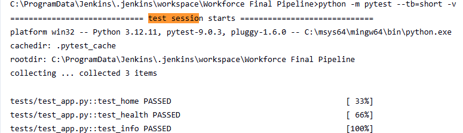
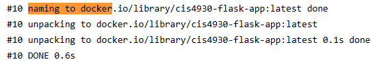
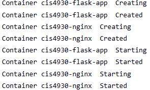
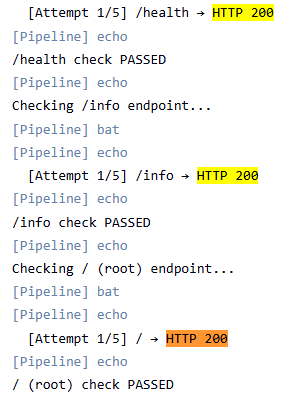
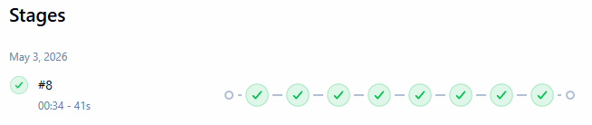
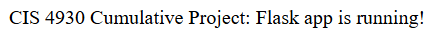
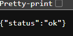
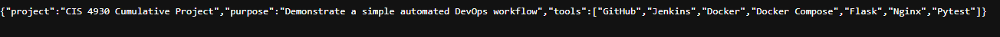

# CIS 4930 Cumulative Project
 
This project demonstrates a real-world CI/CD pipeline using multiple industry tools working together: GitHub, Jenkins, Docker, Docker Compose, Flask, Nginx, and Pytest.
 
---
 
## Table of Contents
 
1. [Project Overview](#project-overview)
2. [Tools Used](#tools-used)
3. [Architecture](#architecture)
4. [Application Endpoints](#application-endpoints)
5. [Workflow](#workflow)
6. [Jenkins Setup](#jenkins-setup)
7. [Pipeline Stages Explained](#pipeline-stages-explained)
8. [Running the Project Locally](#running-the-project-locally)
9. [Demo Screenshots](#demo-screenshots)
---
 
## Project Overview
 
The goal of this project is to simulate a real-world DevOps pipeline where a Flask web application is automatically tested, containerized, deployed behind a reverse proxy, and verified — all triggered and orchestrated by Jenkins.
 
When a developer pushes code to GitHub, Jenkins picks it up, runs the full pipeline, and confirms the live application is healthy before declaring success.
 
---
 
## Tools Used
 
| Tool | Purpose |
|---|---|
| **GitHub** | Version control and source of truth for all project files |
| **Jenkins** | CI/CD automation — orchestrates the entire pipeline |
| **Docker** | Packages the Flask app into a reproducible container image |
| **Docker Compose** | Manages multi-container deployment (Flask + Nginx together) |
| **Flask** | Lightweight Python web application |
| **Nginx** | Reverse proxy that routes external traffic to the Flask container |
| **Pytest** | Automated test suite that runs before any deployment |
 
---
 
## Architecture
 
```
Client (browser / curl)
          │
          ▼
    Nginx  (host port 8081  →  container port 80)
          │
          ▼  proxy_pass
    Flask App  (container port 5000, not exposed to host)
```
 
Nginx is the only service with a public port. It forwards every request to the Flask container over Docker's internal network. This mirrors a production pattern where the app server is never directly reachable from the outside.
 
```
┌─────────────────────────────────────────────┐
│              Docker Network                 │
│                                             │
│  ┌──────────────┐     ┌──────────────────┐  │
│  │  nginx:latest│────▶│ cis4930-flask-app│  │
│  │  port 80     │     │ port 5000        │  │
│  └──────┬───────┘     └──────────────────┘  │
│         │                                   │
└─────────┼───────────────────────────────────┘
          │ host port 8081
          ▼
      Developer / Jenkins
```
 
> **Port summary:**
> - `localhost:8080` → Jenkins UI
> - `localhost:8081` → Live Flask app through Nginx
 
---
 
## Application Endpoints
 
| Endpoint | Method | Description |
|---|---|---|
| `/` | GET | Home page — confirms the app is running |
| `/health` | GET | Returns `{"status": "ok"}` — used by Jenkins for deployment verification |
| `/info` | GET | Returns project metadata (name, tools used, purpose) |
 
---
 
## Workflow
 
```
 1. Developer pushes code to GitHub
          │
          ▼
 2. Jenkins detects the push (SCM polling or webhook)
          │
          ▼
 3. Checkout  →  pulls the latest code onto the Jenkins agent
          │
          ▼
 4. Install Dependencies  →  pip installs Flask and Pytest
          │
          ▼
 5. Run Tests  →  Pytest runs all tests in /tests
          │        if any test fails, pipeline stops here
          ▼
 6. Build Docker Image  →  docker build packages the app
          │
          ▼
 7. Deploy with Docker Compose  →  brings up Flask + Nginx containers
          │
          ▼
 8. Verify Deployment  →  curl probes /, /health, and /info through Nginx
          │                 retries up to 5 times per endpoint
          │                 prints full response bodies to the log
          ▼
 9. post { always }  →  docker compose down cleans up containers
```
 
---
 
## Jenkins Setup
 
### Prerequisites
 
- Jenkins installed and running on Windows
- Docker Desktop installed and **running** before triggering the pipeline
- Python 3 and pip available on the system PATH
- `curl` available on the system PATH
- A GitHub repository containing this project
### Accessing Jenkins
 
Open your browser and go to:
 
```
http://localhost:8080
```
 
Jenkins runs on port 8080 by default. The Flask app (through Nginx) runs separately on port 8081 — these two ports do not conflict.
 
### Connecting Jenkins to GitHub
 
1. Log in to Jenkins at `http://localhost:8080`
2. Click **New Item** → enter a name → select **Pipeline** → click **OK**
3. Scroll to the **Pipeline** section at the bottom of the page
4. Set **Definition** to `Pipeline script from SCM`
5. Set **SCM** to `Git`
6. Paste your GitHub repository URL into the **Repository URL** field
7. Set **Branch Specifier** to `*/main`
8. Set **Script Path** to `Jenkinsfile`
9. Click **Save**
### Triggering the Pipeline
 
**Option A — Manual run (recommended for demos):**
Click **Build Now** on the left sidebar of your Jenkins job.
 
**Option B — SCM Polling:**
Under **Build Triggers**, enable **Poll SCM** and set the schedule to `H/5 * * * *` (checks every 5 minutes for new commits).
 
**Option C — GitHub Webhook:**
Under **Build Triggers**, enable **GitHub hook trigger for GITScm polling**. Then in your GitHub repo go to **Settings → Webhooks → Add webhook** and set the Payload URL to:
```
http://localhost:8080/github-webhook/
```
 
---
 
## Pipeline Stages Explained
 
### Stage 1 — Checkout
Jenkins pulls the latest commit from GitHub onto the agent workspace. This is the starting point for every run.
 
### Stage 2 — Install Dependencies
Installs `flask` and `pytest` using pip from `requirements.txt`.
 
### Stage 3 — Run Tests
Runs the full Pytest suite in `/tests`. If any test fails, the pipeline stops here and never touches Docker. This is the safety gate.
 
### Stage 4 — Build Docker Image
Builds a Docker image from the `Dockerfile` and tags it `cis4930-flask-app`.
 
### Stage 5 — Deploy with Docker Compose
Tears down any previous containers, then brings up both the `flask-app` and `nginx` containers in detached mode.
 
### Stage 6 — Verify Deployment Through Nginx
Waits 5 seconds for containers to initialize, then checks `/health`, `/info`, and `/` through Nginx on port 8081. Retries up to 5 times per endpoint. Prints full response bodies at the end as proof of a live deployment.
 
### Post Actions
- **Always:** tears down containers to keep the host clean between runs
- **On failure:** dumps `docker compose logs` to help diagnose issues
---
 
## Running the Project Locally
 
### Without Jenkins (manual test)
 
```bash
# 1. Clone the repo
git clone https://github.com/Muski19/cis4930-cumulative-project
cd cis4930-cumulative-project
 
# 2. Install Python dependencies
pip install -r requirements.txt
 
# 3. Run tests
python -m pytest --tb=short -v
 
# 4. Start the stack
docker compose up -d --build
 
# 5. Verify manually
curl http://localhost:8081/health
curl http://localhost:8081/info
curl http://localhost:8081/
 
# 6. Tear down
docker compose down
```
 
### With Jenkins (full pipeline)
 
1. Make sure Docker Desktop is running (whale icon in system tray shows "Docker Desktop is running")
2. Open Jenkins at `http://localhost:8080`
3. Create the pipeline job as described in [Jenkins Setup](#jenkins-setup)
4. Click **Build Now**
5. Open **Console Output** to watch each stage in real time
6. A green/blue pipeline overview means all stages passed including deployment verification
---

---

## Demo Screenshots

### Pytest Passing -- Run Tests



### Deploying with Docker Compose



### Verification Retry Loop via Nginx



### Verifying `/health`, `/info`, and Home Page



### Green Pipeline View



### Home Page View



### Health Page View



### Info Page View


